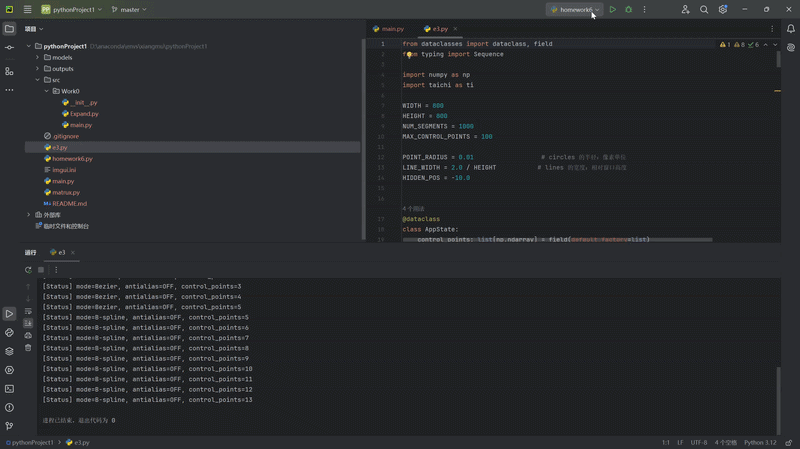

- De Casteljau 算法计算 Bézier 曲线
- 基于 Frame Buffer 的像素级光栅化绘制
- 鼠标交互式添加控制点
- `C` 键清空画布
- 选做功能 1：反走样抗锯齿
- 选做功能 2：均匀三次 B 样条曲线，并支持与 Bézier 模式切换
- 全部完成

- ## 运行演示



## 仓库结构

```text
bezier_taichi_lab/
├── .gitignore
├── README.md
└── main.py

交互说明

- 鼠标左键：添加控制点
- C：清空所有控制点
- B：在 Bézier / B-spline 模式之间切换
- A：开启 / 关闭抗锯齿
- ESC：退出程序

与实验要求的对应关系

1. De Casteljau 算法

main.py中的 de_casteljau(points, t)是纯 Python 实现，按递归线性插值思路逐层收缩控制多边形，最终得到曲线点。

2. 光栅化与 Frame Buffer

pixels`：大小为 `800 x 800` 的 `ti.Vector.field(3, ti.f32)`，作为像素缓冲区
curve_points_field`：大小为 `1001`，承接 CPU 端一次性算好的曲线采样点
draw_curve_kernel(n, antialias)`：在 GPU 端并行把曲线点映射到像素并着色

3. 交互控制点

由于 `canvas.circles()` 和 `canvas.lines()` 适合接收定长 Taichi Field，本项目采用“对象池”方式：

- `gui_points` 固定长度为 `MAX_CONTROL_POINTS`
- `line_starts` / `line_ends` 固定长度为 `MAX_CONTROL_POINTS - 1`
- 未使用的位置填成屏幕外坐标 `(-10, -10)`，从而达到“隐藏未激活对象”的效果

4. 批处理思路

1. CPU 端先批量算出全部曲线采样点
2. 用 `curve_points_field.from_numpy(...)` 一次性拷到 GPU
3. 用 Taichi Kernel 并行绘制到 `pixels`
4. 再用 `canvas.set_image(pixels)` 显示

这样可以避免在 Python 循环里频繁逐点跨 CPU/GPU 边界写入，符合题目要求。

选做功能说明

反走样

按A键后，程序会对每个精确浮点曲线点周围的 `3x3` 局部像素做距离衰减加权，从而得到更平滑的边缘效果。

B 样条曲线

按B键切换后，程序使用 **均匀三次 B-spline**：

至少需要 4 个控制点
每段由相邻 4 个控制点共同决定
相比高阶 Bézier，具有更好的局部控制性
